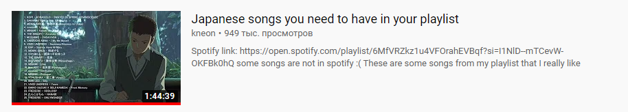
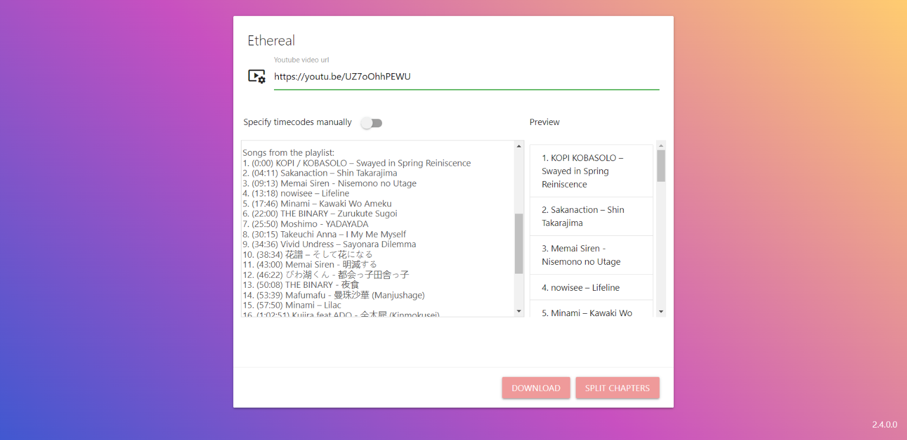
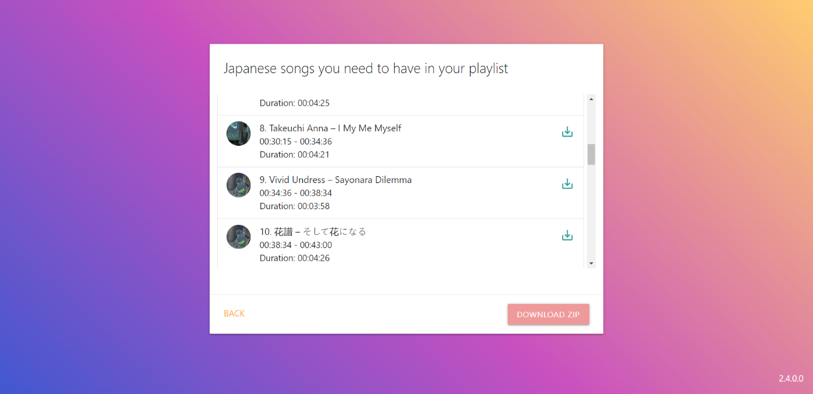
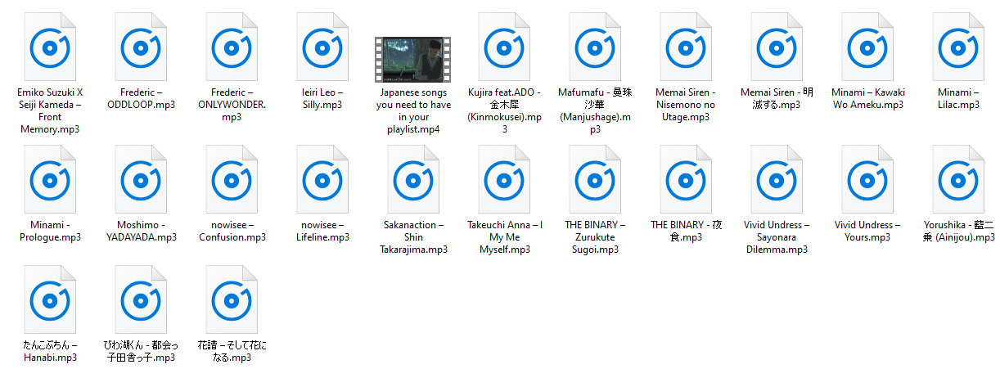

# Ethereal
**Ethereal** is a service that splitting youtube video chapters into mp3 files using just url and (optionally) timecodes. For most of processing operations it uses [FFMPEG](https://www.ffmpeg.org/) and [yt-dlp](https://www.videohelp.com/software/yt-dlp).


Working preview web application: http://81.177.135.200 (*TEMPORARY NOT WORKING DUE TO SERVER`S TERRITORIAL ISSUES WITH YOUTUBE SERVICES*)






## Syntax
There is no strict rule, if youtube recognize chapters from your video then we can parse it without any other additional actions.
How do youtube chapters work: https://www.tubics.com/blog/youtube-chapters/

Correct (https://youtu.be/UZ7oOhhPEWU):
```
1. (0:00) KOPI / KOBASOLO – Swayed in Spring Reiniscence
2. (04:11) Sakanaction – Shin Takarajima
3. (09:13) Memai Siren - Nisemono no Utage
```
Correct as well (https://youtu.be/CU_ruPKWJpc):
```
0:00 Lazerhawk - So Far Away 
https://soundcloud.com/lazerhawk/so-f...
https://lazerhawk.bandcamp.com/

4:38  Zane Alexander - Elementary
https://soundcloud.com/thezanealexand...
https://zanealexander.bandcamp.com/al...

8:55 oDDling - Reverie
https://soundcloud.com/oddlingmusic/r...
https://oddling.bandcamp.com/releases
```
If your video has no timecodes in description, but you got one (often situation when people leave time codes in comments) or writted it by yourself, then you can explicit custom description with timecodes with youtube like syntax.
Ensure that you have new line after each time code.

## Stack / Dependencies
* PostgreSQL 13 
* FFMPEG 4.2.4-1ubuntu0.1
* .NET 6.0 (ASP.NET Core Runtime 6.0.16)
* yt-dlp 2023.03.04

## Backend
working app: http://81.177.135.200 </br>
swagger: http://81.177.135.200/swagger/index.html </br>
hangfire dashboard: http://81.177.135.200/hangfire </br>
healthcheck: http://81.177.135.200/api/hc

```
$ chmod +x scripts/run.sh
$ ./scripts/run.sh
```

### **Path executables**
Download and install fmpeg (https://ffmpeg.org/)<br>
Download and install yt-dlp (https://www.videohelp.com/software/yt-dlp)<br>

Specify path to FFMPEG/yt-dlp executables in **appsetings.json**:

**Linux**:
```json
 "System": {
    "TempPath" : "{current}\\bin\\temp",
    "FfmpegExecutablesPath" : "ffmpeg",
    "YtdlpExecutablesPath" : "yt-dlp",
    "VideoDurationLimit" : "05:00:00",
    "DownloadingTimeout": "00:01:00",
    "YouTubeProvider": "yt-dlp"
  },
```
**Windows**:
```json
"System": {
    "TempPath" : "{current}\\bin\\temp",
    "FfmpegExecutablesPath" : "C:\\path\\to\\ffmpeg.exe",
    "YtdlpExecutablesPath" :  "C:\\path\\to\\yt-dlp.exe",
    "VideoDurationLimit" : "05:00:00",
    "DownloadingTimeout": "00:01:00",
    "YouTubeProvider": "yt-dlp"
  },
```

## Development
### Updating frontend version

1. do frontend changes in angular project
1. ```cd frontend```
1. ```export NODE_OPTIONS=--openssl-legacy-provider```
1. ```ng build --watch```
1. ```rm ../src/Ethereal.WebAPI/Frontend/*```
1. ```cp -r "./dist/ethereal/." "../src/Ethereal.WebAPI/Frontend"```

## Linux issues
If video downloading stage is skipping and job`s outcome results is not valid mp4/mp3 files - update yt-dlp by following this command:
```
yt-dlp -U
```
