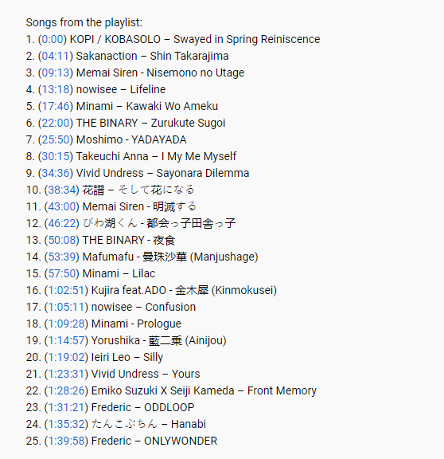
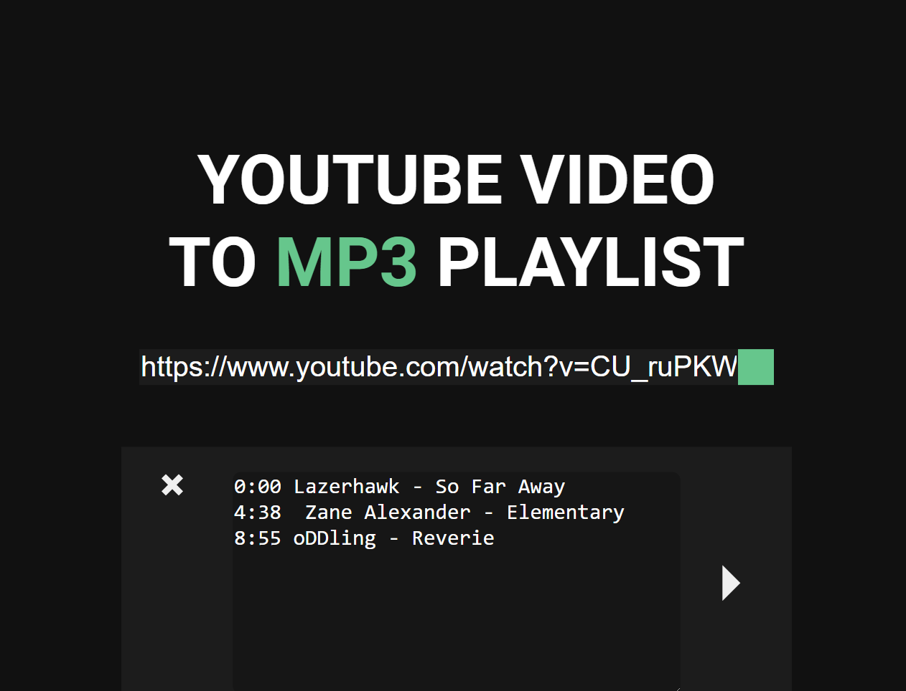

# YOVPS
**Youtube One Video Playlist Splitter** - Service that splitting huge youtube one-video playlists to mp3 files using just url and time code description (optionally).

Demo url: http://81.177.135.200/





## Syntax
There is just one strict rule - use only one line per each song

Correct (https://www.youtube.com/watch?v=UZ7oOhhPEWU&t=3448s&ab_channel=kneon):
```
1. (0:00) KOPI / KOBASOLO – Swayed in Spring Reiniscence
2. (04:11) Sakanaction – Shin Takarajima
3. (09:13) Memai Siren - Nisemono no Utage
```
Incorrect (https://www.youtube.com/watch?v=CU_ruPKWJpc&t=82s&ab_channel=Asthenic):
```
0:00 Lazerhawk - So Far Away 
https://soundcloud.com/lazerhawk/so-f...
https://lazerhawk.bandcamp.com/

4:38  Zane Alexander - Elementary
https://soundcloud.com/thezanealexand...
https://zanealexander.bandcamp.com/al...

8:55 oDDling - Reverie
https://soundcloud.com/oddlingmusic/r...
https://oddling.bandcamp.com/releases
```
To make this template work, you have to edit it by yourself and put in custom description box like that:


## Backend
* .NET 5.0
* ASP.NET Core 5.6.3
* NLog 4.5.11
* FFMPEG 4.2.4-1ubuntu0.1
* FluentValidation 10.3.0
* Autofac 6.2.0
* AutoMapper 10.1.1
* Nunit 3.13.1
  * FluentAssertions 5.10.3

test server endpoint: http://81.177.135.200:322 </br>
swagger: http://81.177.135.200:322/swagger/index.html

```
$ chmod +x scripts/run.sh
$ ./scripts/run.sh
```

### FFMPEG
Download and install fmpeg (https://ffmpeg.org/)<br>
Specify path to FFMPEG executables in **appsetings.json**:

**Linux**:
```json
"FFMPEG": {
    "TempPath" : "{current}/temp",
    "ExecutablesPath" : "ffmpeg"
}
```
**Windows**:
```json
"FFMPEG": {
    "TempPath" : "{current}/temp",
    "ExecutablesPath" : "C://Path//To//ffmpeg.exe"
}
```

## Frontend
* PUG
* SCSS
